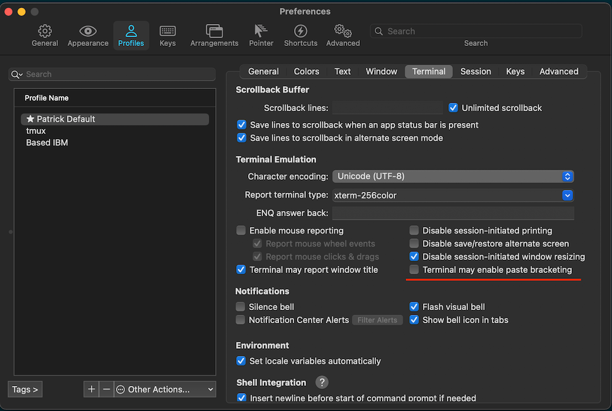

# "Terminal may enable paste bracketing" setting

iTerm 2 has a [setting](https://iterm2.com/documentation-preferences-profiles-terminal.html) that is enabled by default that terminal sessions to dictate if bracketed paste is enabled. This can be annoying if you use the same terminal session for ssh, log out, and then try to use vim/neovim and paste in text. Even iTerm recognizes this and provides you with an error message that says "Looks like paste bracketing was left on when an ssh session ended unexpectedly or an app misbehaved. Turn it off?" Well, we can circumvent that by just toggling the following setting.

### Notes
Bracketed paste works automatically in Neovim which avoids the need for [bracketedpaste.vim](https://github.com/mr-mustash/dotfiles/blob/e68bf1a4dc2c5b0a8314b80a9a2de7cf29f7e471/tilde/.config/nvim/plugin/bracketedpaste.vim) in my configs.

### References
* `:h bracketed-paste-mode` in neovim
* https://jdhao.github.io/2021/02/01/bracketed_paste_mode/
